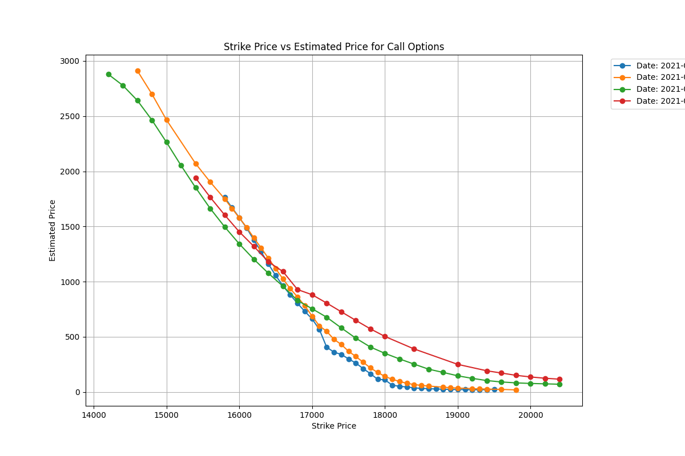

# Constrained Deep Learning for Option Pricing

Undergraduate thesis project (National Yang Ming Chiao Tung University, 2024–2025) on one-day-ahead pricing of TAIEX index options (TXO). The models add pricing-theory terms to a neural network's loss and architecture; how far each mechanism really constrains the model is stated in the table below and under [Known issues](#known-issues-and-limitations). Each contract's last 10 trading days are arranged as a three-channel tensor (contract terms and volume, Greeks, prices) and passed to convolutional-recurrent and Transformer models.

| Mechanism | Where | What the code does, and its limit |
|---|---|---|
| PDE-style residual penalty | Loss of the dual-branch network (`main/main_dual_network.py`) | Soft penalty, weight 0.1: squared residual from autograd derivatives with respect to the time-to-maturity and underlying inputs. Those inputs reach the output through a piecewise-linear path (linear layer, ReLU MLP), so the second-derivative (gamma) term is identically zero and only first-order terms act |
| Positive-weight moneyness embedding | Transformer branch, `ConstrainedLinear` in `core/models_dual_network.py` | Softplus-positive weights in the moneyness input projection. The layers after it are unconstrained, so this does not make the price monotone in moneyness |
| Softplus output | ConvLSTM baseline, `core/models_convlstm.py` | Applied to the standardized target, so it bounds the standardized output, not the price. The dual-branch network has no output constraint |
| Strike-monotonicity plot | `main/check_monotonic.py` | Plots predicted call prices against strike per maturity for one date (2021-05-03). Visual inspection only, no automated test |

The tensor representation and the ConvLSTM / LSTM baselines follow **Ge, Zhou, Luo and Tian (2021), "3D Tensor-based Deep Learning Models for Predicting Option Price"** ([arXiv:2106.02916](https://arxiv.org/abs/2106.02916)), which studied Chinese 50ETF options. This repository applies the framework to the Taiwan market and extends it:

- a TXO data pipeline: TAIFEX daily quotes with TXF futures as the underlying, implied volatility and Greeks, settlement-price filling for days without trades, put–call-parity conversion of puts;
- **MultiPatchFormer (MPF)**, adapted from Naghashi et al. (2025) to the option tensors, with its temporal encoder replaced by FANformer layers (Dong et al., 2025): multi-scale patch embedding, channel-wise attention and a single-step decoder;
- a **dual-branch network**: ConvLSTM branch plus a Transformer branch with a positive-weight moneyness projection and date positional encoding, trained with a PDE-style residual penalty derived from the Black–Scholes equation;
- density-based sample re-weighting (kernel density estimate over moneyness), rolling-window training with warm starts and a two-model ensemble, VIF-based feature selection, a learning-rate range test;
- a Kou jump-diffusion benchmark priced with the Carr–Madan FFT, recalibrated daily.

## Data

| Item | Detail |
|---|---|
| Instruments | TXO calls and puts (European, cash-settled); underlying proxy: TXF futures price |
| Sample | Daily, 2021-01-04 to 2021-12-30 (244 trading days); about 80,800 contract-days after preprocessing. The raw file covers 2014–2021; the scripts keep 2021 |
| Raw files | `data/TXO_with_TXF.csv` (contract terms, price, underlying, rate, volume) and the TAIFEX daily option quote archives `data/2021_opt.zip`, `data/2022_opt.zip` |
| Derived fields | Implied volatility (Brent root search), delta, gamma, theta, rho, Black–Scholes theoretical price and margin, moneyness −ln(K/S)/(σ√τ), time value; see `core/functions.py` |
| Model inputs | `data/prs_dataset_mpf.csv`, `data/prs_dataset_dual.csv`, `data/prs_dataset_new.csv`, and the tensors in `data/torch-data/` |

Input tensors (samples × channels × days × features):

| Model | Shape | Channels |
|---|---|---|
| MPF | N × 3 × 10 × 4 | (volume, strike, moneyness, time value), (delta, rho, theta, gamma), (previous settlement, settlement change, theoretical margin, theoretical price) |
| ConvLSTM, dual-branch | N × 3 × 10 × 5 | (volume, call/put flag, time to maturity, implied volatility, strike), five Greeks, (previous settlement, change, underlying, theoretical margin, theoretical price); the dual-branch model also receives N × 1 × 10 × 2 with transformed moneyness and date position |

Targets: next-day option price (ConvLSTM, dual-branch) or next-day time value (MPF).

## Models

| Model | File | Summary |
|---|---|---|
| ConvLSTM, LSTM, CNN+RNN | `core/models_convlstm.py`, `core/models_lstm.py`, `core/models_CNN_RNN.py` | Baselines following Ge et al. (2021) |
| MultiPatchFormer | `core/models_multi_patch_former_adjusted.py`, `core/models_fanformer.py` | Conv1d patch embeddings with kernels 2–5 plus a global token; three FANformer layers (periodic projections, rotary embeddings, SwiGLU), 4 heads, width 128; gated channel-wise attention; about 2.3M parameters |
| Dual-branch network | `core/models_dual_network.py` | ConvLSTM branch (16/8/1 channels) and an MPF encoder branch whose moneyness projection has softplus-constrained weights; fusion MLP 256–128–1; about 4.3M parameters. Loss = weighted MSE + 0.1 × squared PDE-style residual (autograd derivatives with respect to the time-to-maturity and underlying inputs, r = 0.79%; see Known issues) |
| Kou benchmark | `core/benchmarks_fftoption.py` | Double-exponential jump diffusion via Carr–Madan FFT, calibrated on day *t*, tested on day *t+1* |

Training: Adam (1e-4), batch size 64, up to 100 epochs with early stopping; MPF uses linear warm-up and cosine decay, the dual-branch network uses ReduceLROnPlateau.

## Evaluation protocol

- **Static split** (`core/data_preprocess_taiex_option_type2*.py`): the year is cut into 16 non-overlapping blocks of 15 trading days. In each block days 1–10 are history only, days 11–13 provide training labels, day 14 validation labels and day 15 test labels (12,980 / 4,035 / 3,846 samples for MPF). `Data_preprocess.pdf` sketches the scheme.
- **Rolling windows** (`main/main_mpf_rolling_network.py`): train, validate and test on consecutive date ranges, slide forward, warm-start from the previous window, average the two best models. Normalization statistics come from the training part only.

## Results

Stored test metrics, static split, option-price units (index points):

| Model | MSE | MAE | Correlation | Source |
|---|---|---|---|---|
| ConvLSTM baseline | 12,632.7 | 57.97 | 0.9750 | `main/testing_result/convlstm_testing_result(syn).txt` |
| Dual-branch network | 6,482.7 | 52.74 | 0.9870 | `main/testing_result/dualnetwork_testing_result(syn).txt` |
| MultiPatchFormer | 6,854.8 | 42.75 | 0.9877 | `main/testing_result/mpf_testing_result(syn).txt` |

The dual-branch network lowers the ConvLSTM baseline's test MSE by 48.7% on the same target. `main/check_monotonic.py` plots predicted call prices against strike for each maturity, a visual check of the no-arbitrage property that call prices decrease in strike; the stored plot is for 2021-05-03:



Stricter tests:

- Rolling windows, MPF, 12 windows pooled (10,476 test samples, `main/testing_result/rolling_windows/all_window_results_Mar07_092454.csv`): RMSE 215.1, MAE 108.6, correlation 0.907. The weakest window covers the May 2021 sell-off.
- Kou benchmark with daily recalibration (`core/result/kjdate_loss_message_dataframe.csv`, 138 days to 2021-07-30): mean daily MSE 5,305.7. It is evaluated on a different sample from the networks, so the figures are not directly comparable.

## Known issues and limitations

The static-split numbers above are optimistic. They are reported as stored; the points below explain why they should be read with care.

1. **Interleaved split.** Test days are spread through 2021 and lie one or two days after training labels of the same contracts, and later training blocks come after earlier test days. It measures interpolation within a regime rather than forecasting an unseen period; the rolling-window result is the more honest estimate and is much weaker.
2. **Per-split normalization.** In the static scripts each split is standardized with its own mean and standard deviation, and test predictions are converted back with the test labels' statistics. Only the rolling script uses training-set statistics throughout.
3. **MPF sample weights are inactive.** In `main/main_mpf_network.py` the density estimate is fitted on raw values but evaluated on standardized inputs, so all weights are equal and the loss reduces to plain MSE. The dual-branch and rolling scripts weight by moneyness.
4. **Near-circular inputs.** The theoretical price is Black–Scholes evaluated at the implied volatility backed out of the same day's price, so the inputs contain yesterday's price almost exactly. No "yesterday's price" baseline is included, and it should be the first comparison added.
5. **The PDE term is weaker than its name.** In `compute_pde_loss` the time and underlying inputs enter the network through a linear layer followed by a ReLU MLP, so the output is piecewise linear in them: the gamma term ½σ²S²·∂²V/∂S² is identically zero and the penalty reduces to first-order terms. The derivative is taken with respect to time to maturity but carries the sign for calendar time, all quantities are standardized while r is not, the volatility used is the standardized one, and the underlying is a futures price (for which Black-76 has no drift term). Exceptions inside the function return a zero loss. The penalty therefore regularizes input sensitivities; it does not enforce the Black–Scholes operator.
6. **Baseline provenance.** The published ConvLSTM ends in a softplus on the standardized target, yet the stored baseline predictions (`main/Feb01_113359_convlstm_test_predicted_result.csv`) contain 344 negative prices out of 3,846, so they come from an earlier code version. The 48.7% improvement compares stored result files, not a re-run of the published baseline.
7. **Scope.** One market and one year of daily settlement data, single runs without fixed seeds, no bid–ask spreads, and no hedging or trading test. Missing underlying values are interpolated linearly, and no-trade days are filled with settlement prices.
8. **Mixed artifacts.** Checkpoints, tensors and result files in the repository come from several code versions; `data/train_data.csv`, `data/test_data.csv` and `data/test_data_BS.csv` are 50ETF files from the original study, not TXO data.

## Repository layout

| Path | Contents |
|---|---|
| `core/` | Model definitions, preprocessing scripts (`data_preprocess_taiex_option_type2_mpf.py`, `..._dual.py`, `process_complementary_data.py`), pricing utilities (`functions.py`), FFT benchmark and its results |
| `main/` | Training and evaluation entry points (`main_mpf_network.py`, `main_mpf_rolling_network.py`, `main_dual_network.py`, `main_convlstm.py`, `main_lstm.py`, `main_CNN_RNN.py`), learning-rate range test, metric and monotonicity checks, `visualization.ipynb` |
| `main/checkpoints/`, `main/loss_curves/`, `main/testing_result/` | Generated weights, loss curves and test outputs |
| `data/` | Raw and processed data, `torch-data/` tensors |
| `feature_analysis/` | VIF feature selection and distribution analysis |
| `Data_preprocess.pdf` | Diagram of the static split |

## Running

```bash
pip install -r requirements.txt

cd core
python data_preprocess_taiex_option_type2_mpf.py     # or ..._dual.py
cd ../main
python main_mpf_network.py                           # static split, MPF
python main_dual_network.py                          # static split, dual-branch network
python main_mpf_rolling_network.py                   # rolling windows
```

The scripts were developed on three machines and still contain absolute paths (`/home/...`, `C:\Users\...`, `/Users/...`); set the data directory at the top of each script first. `main_mpf_network.py` selects the Apple `mps` device explicitly; change it to `cuda` or `cpu` as needed. Run the preprocessing scripts from `core/` and the training scripts from `main/`, since they use relative imports and output folders.

## References

- M. Ge, S. Zhou, S. Luo, B. Tian. 3D Tensor-based Deep Learning Models for Predicting Option Price. arXiv:2106.02916, 2021.
- V. Naghashi, M. Boukadoum, A. B. Diallo. A multiscale model for multivariate time series forecasting (MultiPatchFormer). Scientific Reports 15, 2025. doi:10.1038/s41598-024-82417-4
- Y. Dong et al. FANformer: Improving Large Language Models Through Effective Periodicity Modeling. arXiv:2502.21309, 2025.
- S. G. Kou. A Jump-Diffusion Model for Option Pricing. Management Science 48(8), 2002.
- P. Carr, D. Madan. Option Valuation Using the Fast Fourier Transform. Journal of Computational Finance 2(4), 1999.
